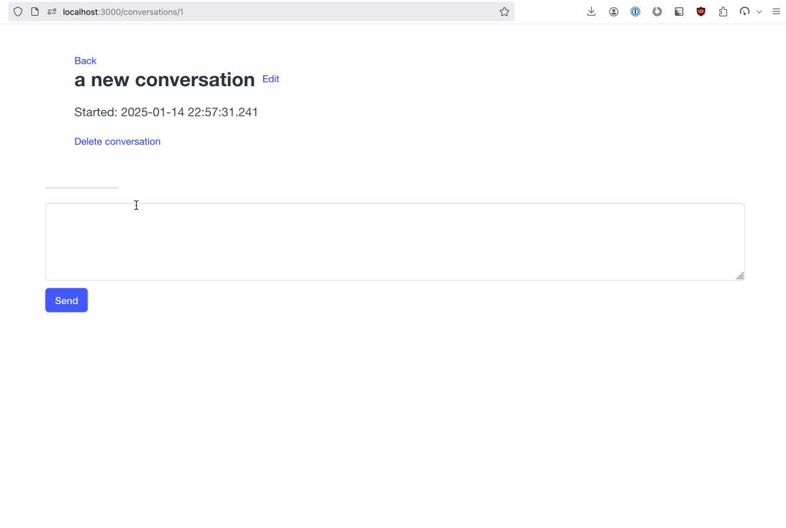

# ochat

## running

1. [install Rust](https://www.rust-lang.org/tools/install)
2. [install Ollama](https://ollama.com/)
3. `cargo install --git "https://github.com/ckampfe/ochat"`
4. `./ochat` or `RUST_LOG=debug ./ochat` if you want debug logging
5. `open localhost:3000`

You can also just clone and build the project that way:

1. `git clone https://github.com/ckampfe/ochat`
2. `RUST_LOG=debug cargo run`
3. `open localhost:3000`

See the help like:

`cargo run -- -h`
